# Collab-Event – Collaborative Event Management Platform

## 📌 Project Description

**Collab-Event** is a modern, full-stack application built with the **MERN Stack (MongoDB, Express, React, Node.js)** designed to streamline event planning and team collaboration.

It empowers users to **create events, form teams, manage tasks in real-time, and communicate seamlessly** via integrated chat. The platform features secure authentication, role-based access control, and a comprehensive **Admin Dashboard** for overseeing users, posts, reports, and platform analytics using visual charts.

## 🚀 Live Demo

* **Frontend:** [https://collab-event.vercel.app](https://collab-event.vercel.app)
* **Backend API:** [https://collab-event-backend-splt.vercel.app](https://www.google.com/search?q=https://collab-event-backend-splt.vercel.app)

---

## 📸 Screenshots

### 🔑 Authentication

| Sign In | Sign Up |
| :---: | :---: |
| 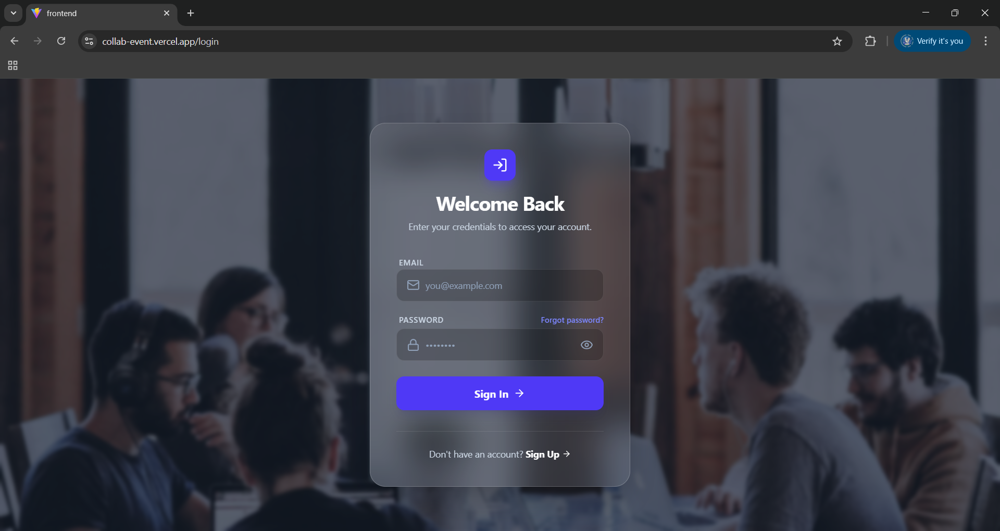 | 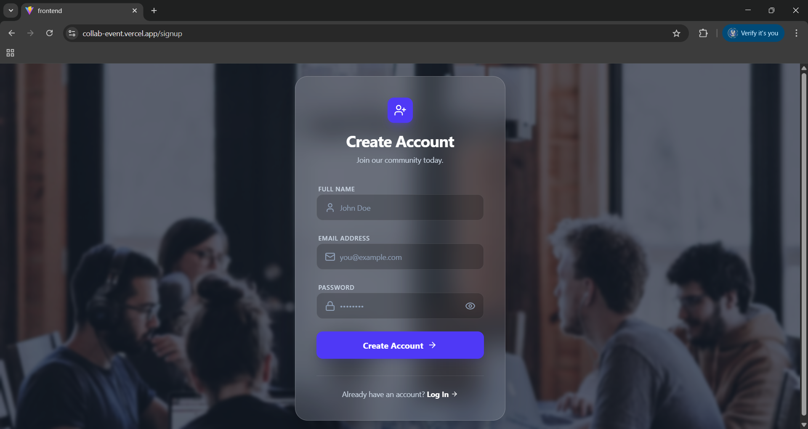 |

### 🏠 User Features

| Dashboard | Create Post |
| --- | --- |
| 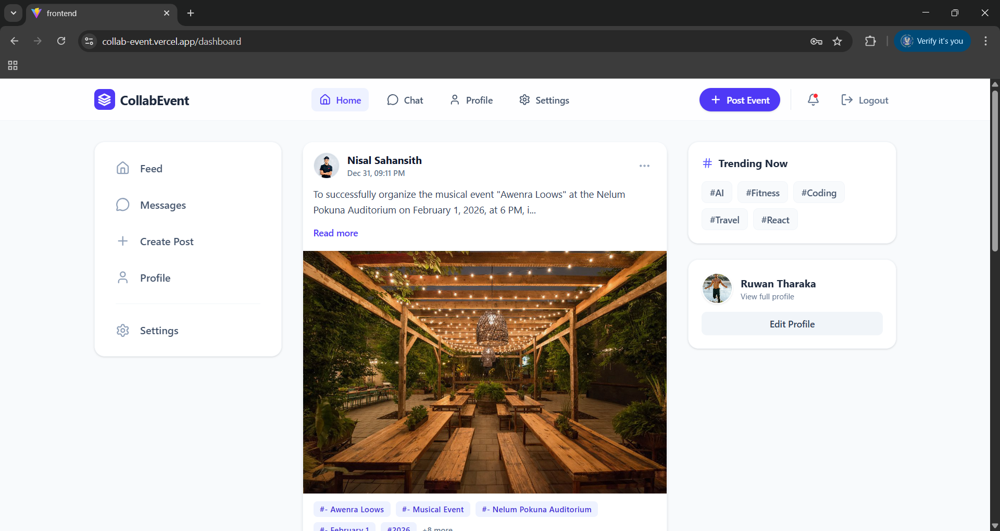 | 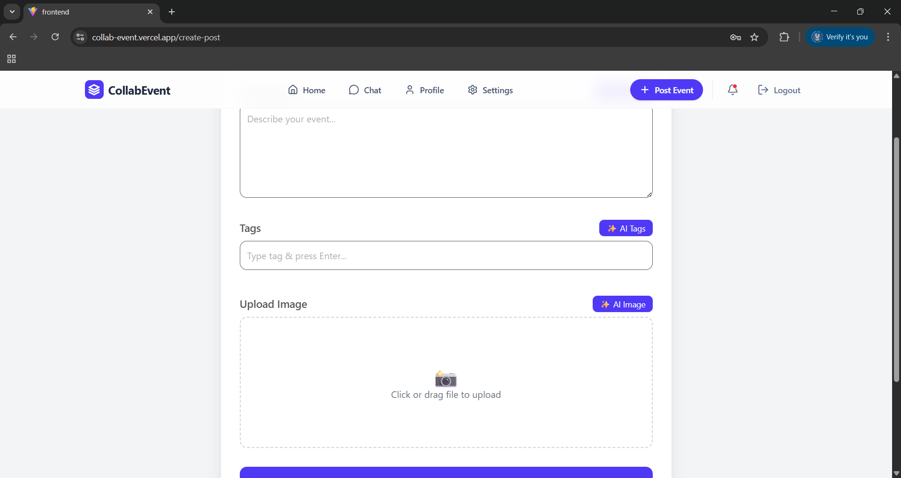 |

| Profile | Chat / Messenger |
| --- | --- |
| 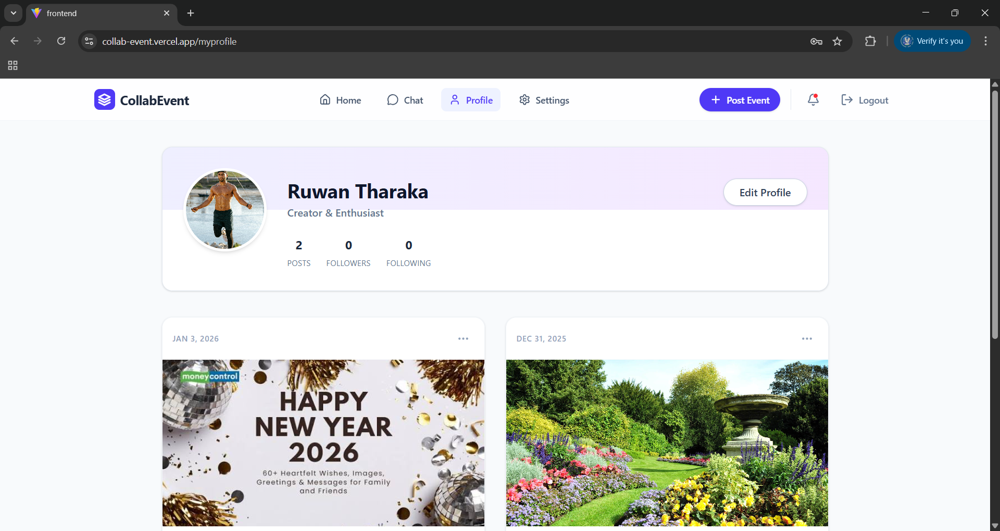 | 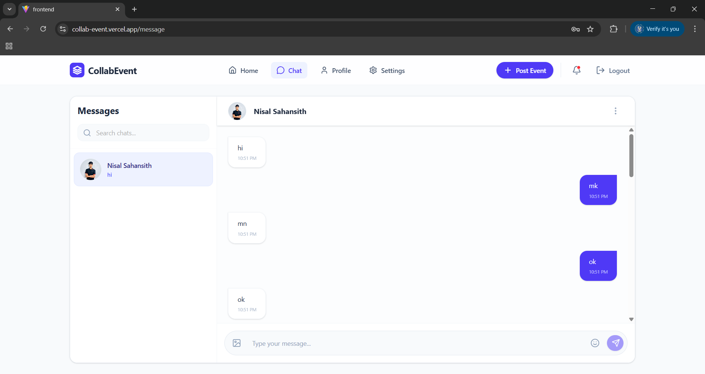 |

### 👤 Profile & Settings

| Settings |
| --- | --- |
| 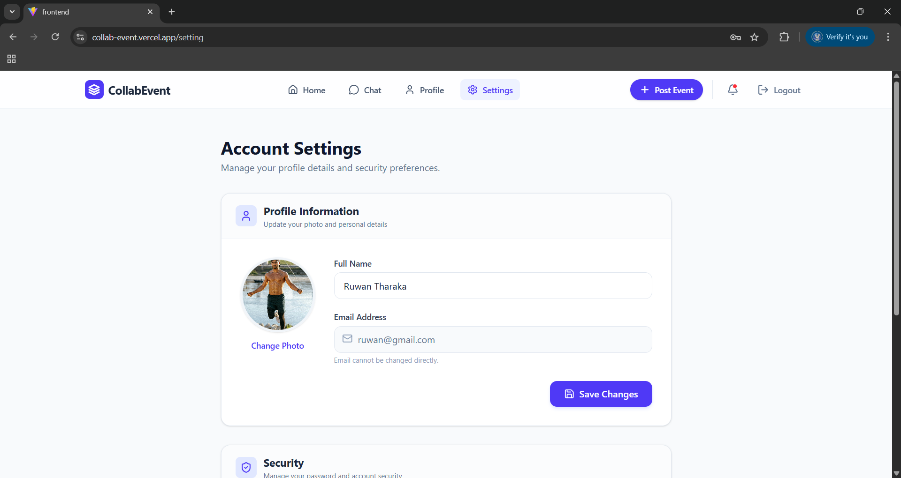 |

### 🛡 Admin Dashboard

| Admin Dashboard | User Management |
| --- | --- |
| 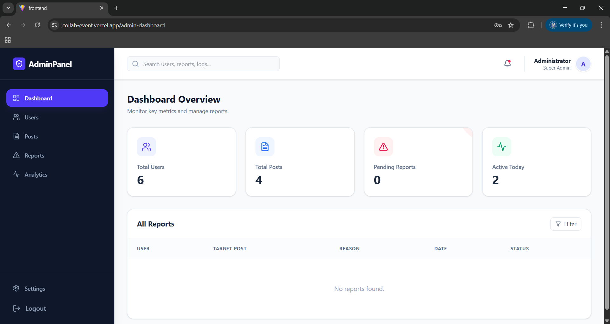 | 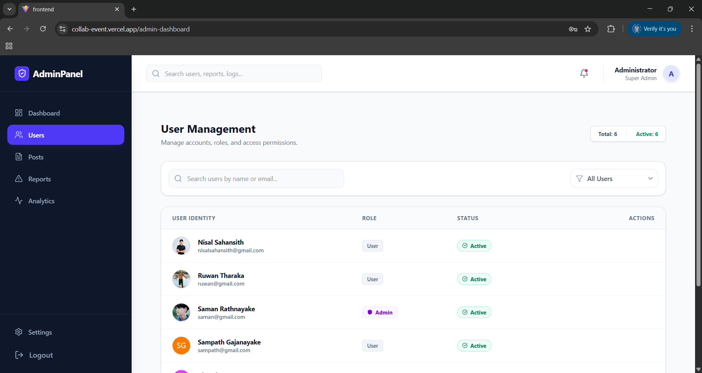 |

| Posts Managemnet | Post view |
| --- | --- |
| 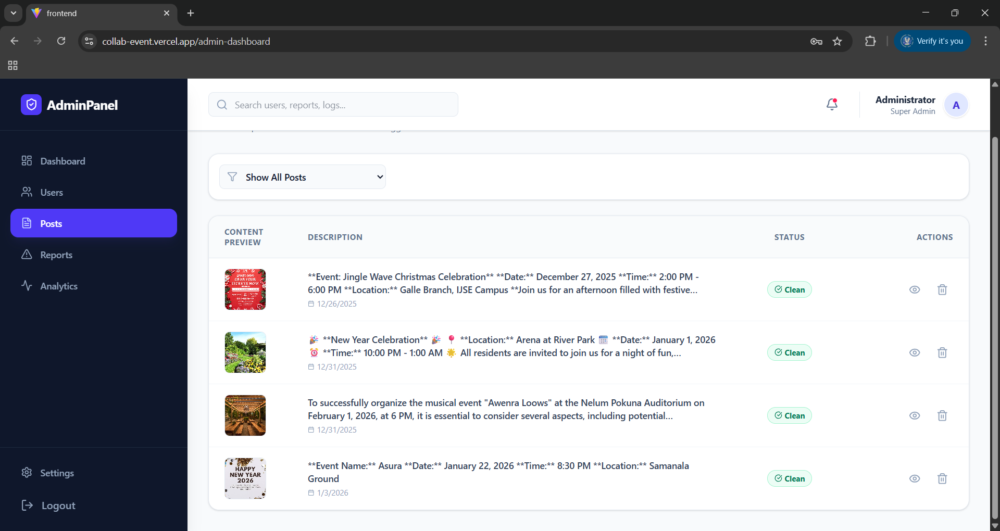 | 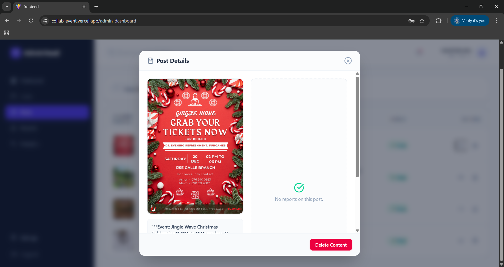 |

| Reports & Moderation | Analytics |
| --- | --- |
| 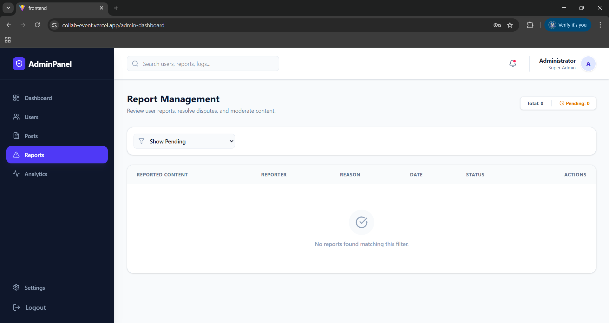 | 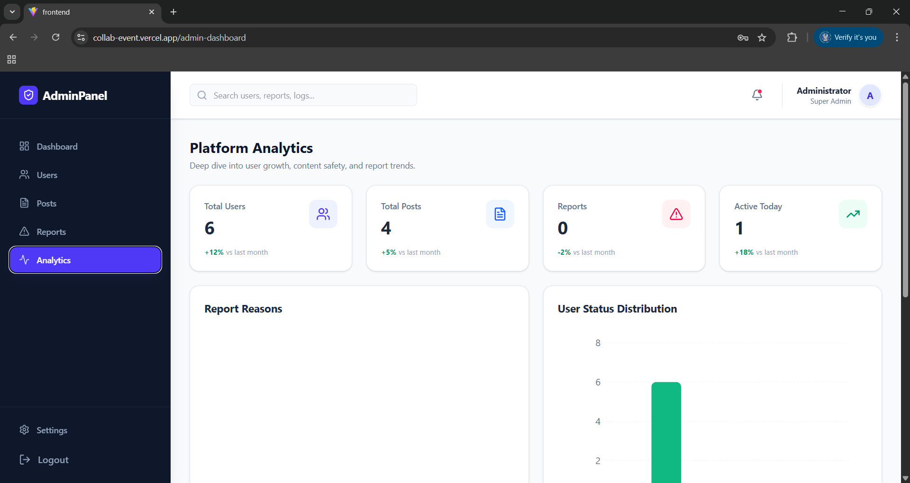 |


---

## ✨ Key Features

* **🔐 Secure Authentication:** JWT-based login/signup with role-based access (Admin/User).
* **📅 Event Management:** Create, edit, and delete events with rich text descriptions and image uploads.
* **💬 Real-time Chat:** Integrated **Socket.io** messaging for instant team communication (Text & Image support).
* **📊 Admin Dashboard:**
* **User Management:** Ban/Unban users, view details.
* **Content Moderation:** Review and dismiss reported posts.
* **Analytics:** Visual charts for user growth, post activity, and report statistics using Recharts.


* **🖼 Image Handling:** Optimized image uploads using **Cloudinary**.
* **📱 Responsive Design:** Fully responsive UI built with **Tailwind CSS**.

---

## 🛠 Tech Stack

| Component | Technology |
| --- | --- |
| **Frontend** | React (Vite), Redux Toolkit, Tailwind CSS, Lucide Icons, Recharts |
| **Backend** | Node.js, Express.js, TypeScript, Socket.io |
| **Database** | MongoDB Atlas (Mongoose ODM) |
| **Authentication** | JWT (JSON Web Tokens) |
| **Storage** | Cloudinary |
| **Deployment** | Vercel (Frontend & Backend) |

---

## ⚙️ Setup Instructions

### ✅ Prerequisites

Ensure you have the following installed:

* **Node.js** (v16+)
* **npm** 
* **MongoDB** (Local or Atlas URL)
* **Git**

### 🔹 1. Clone the Repository

```bash
git clone https://github.com/nisalsahansith/Collab-Event.git
cd Collab-Event

```

### 🔹 2. Backend Setup

Navigate to the backend directory and install dependencies.

```bash
cd backend
npm install

```

Create a `.env` file in the `backend` root and add your credentials:

```env
PORT=5000
MONGO_URI=your_mongodb_connection_string
JWT_SECRET=your_jwt_secret
CLOUDINARY_CLOUD_NAME=your_cloud_name
CLOUDINARY_API_KEY=your_api_key
CLOUDINARY_API_SECRET=your_api_secret

```

Start the server:

```bash
npm run dev

```

### 🔹 3. Frontend Setup

Navigate to the frontend directory and install dependencies.

```bash
cd ../frontend
npm install

```

Start the React development server:

```bash
npm run dev

```

---

## 📂 Project Structure

```bash
Collab-Event/
├── frontend/          # React (Vite) Application
│   ├── src/
│   │   ├── components/
│   │   ├── pages/
│   │   ├── redux/
│   │   └── services/api.ts
│   └── ...
├── backend/           # Node.js Express Server
│   ├── src/
│   │   ├── controllers/
│   │   ├── models/
│   │   ├── routes/
│   │   ├── middleware/
│   │   └── index.ts
│   ├── vercel.json    # Deployment Config
│   └── ...
└── README.md

```

---

## 🤝 Contributing

Contributions are welcome! Please follow these steps:

1. Fork the repository.
2. Create a new branch (`git checkout -b feature/AmazingFeature`).
3. Commit your changes (`git commit -m 'Add some AmazingFeature'`).
4. Push to the branch (`git push origin feature/AmazingFeature`).
5. Open a Pull Request.

---

## 📧 Contact

**Nisal Sahansith** GitHub: [nisalsahansith](https://www.google.com/search?q=https://github.com/nisalsahansith)